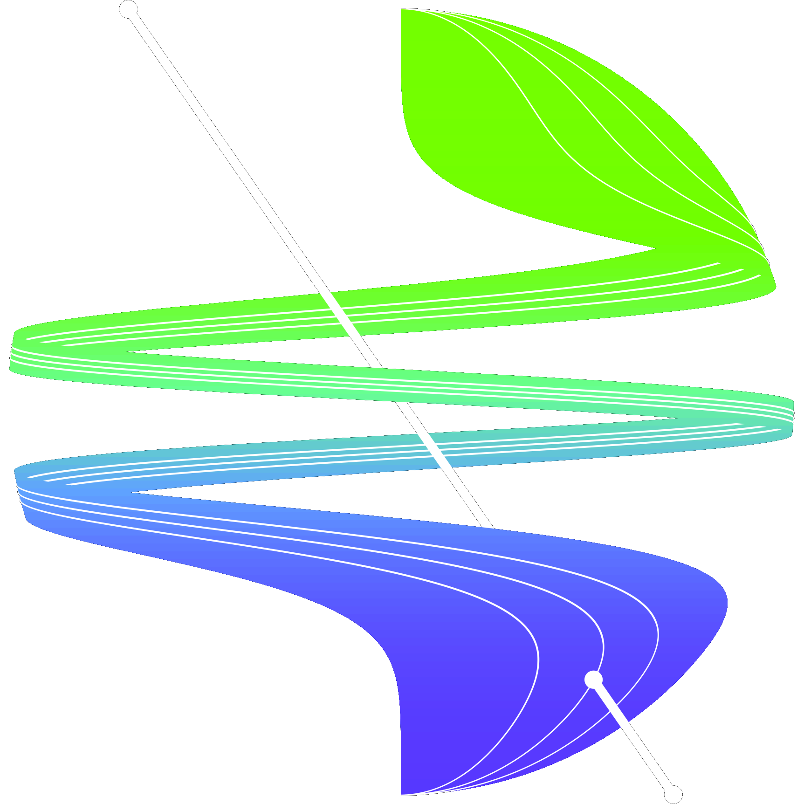

[contributors-shield]: https://img.shields.io/github/contributors/VIS4ROB-lab/HyperSLAM.svg?style=for-the-badge
[contributors-url]: https://github.com/VIS4ROB-lab/HyperSLAM/graphs/contributors
[forks-shield]: https://img.shields.io/github/forks/VIS4ROB-lab/HyperSLAM.svg?style=for-the-badge
[forks-url]: https://github.com/VIS4ROB-lab/HyperSLAM/network/members
[stars-shield]: https://img.shields.io/github/stars/VIS4ROB-lab/HyperSLAM.svg?style=for-the-badge
[stars-url]: https://github.com/VIS4ROB-lab/HyperSLAM/stargazers
[issues-shield]: https://img.shields.io/github/issues/VIS4ROB-lab/HyperSLAM.svg?style=for-the-badge
[issues-url]: https://github.com/VIS4ROB-lab/HyperSLAM/issues
[license-shield]: https://img.shields.io/github/license/VIS4ROB-lab/HyperSLAM.svg?style=for-the-badge
[license-url]: https://github.com/VIS4ROB-lab/HyperSLAM/blob/main/LICENSE
[linkedin-shield]: https://img.shields.io/badge/-LinkedIn-black.svg?style=for-the-badge&logo=linkedin&colorB=555
[linkedin-url]: https://linkedin.com/in/davidhug

[![Contributors][contributors-shield]][contributors-url]
[![Forks][forks-shield]][forks-url]
[![Stargazers][stars-shield]][stars-url]
[![Issues][issues-shield]][issues-url]
[![BSD-3-Clause License][license-shield]][license-url]
[![LinkedIn][linkedin-shield]][linkedin-url]

<br />
<br />
<div align="center">
  <a href="https://github.com/VIS4ROB-lab/HyperSLAM">
    
  </a>

<h2><em>Hyper</em>SLAM</h2>
  <p>
    Modular, open-source implementations of continuous-time simultaneous localization and mapping algorithms.
    <br />
    <a href="https://github.com/VIS4ROB-lab/HyperSLAM/issues">Report Issues or Request Features</a>
  </p>
</div>
<br />

## About

Almost there... We target July/August 2022 as the official release date of *Hyper*SLAM. If you use this repository, please cite it as below.

```
@article{RAL2022Hug,
    author={Hug, David and B\"anninger, Philipp and Alzugaray, Ignacio and Chli, Margarita},
    journal={IEEE Robotics and Automation Letters},
    title={Continuous-Time Stereo-Inertial Odometry},
    year={2022},
    volume={7},
    number={3},
    pages={6455-6462},
    doi={10.1109/LRA.2022.3173705}
}
```

## Literature

1. [Continuous-Time Stereo-Inertial Odometry, Hug et al. (2022)](https://ieeexplore.ieee.org/document/9772323)
2. [HyperSLAM: A Generic and Modular Approach to Sensor Fusion and Simultaneous<br /> Localization And Mapping in Continuous-Time, Hug and Chli (2020)](https://ieeexplore.ieee.org/document/9320417)
3. [Efficient Derivative Computation for Cumulative B-Splines on Lie Groups, Sommer et al. (2020)](https://ieeexplore.ieee.org/document/9157639)
4. [A Micro Lie Theory for State Estimation in Robotics, Solà et al. (2018)](https://arxiv.org/abs/1812.01537)
5. [A Primer on the Differential Calculus of 3D Orientations, Bloesch et al. (2016)](https://arxiv.org/abs/1606.05285)
6. [A Generic Camera Model and Calibration Method for Conventional,<br /> Wide-Angle, and Fish-Eye Lenses, Kannala and Brandt (2006)](https://ieeexplore.ieee.org/document/1642666)
7. [Single View Point Omnidirectional Camera Calibration from Planar Grids, Mei and Rives (2007)](https://ieeexplore.ieee.org/document/4209702)

### Updates

25.07.22 Initial release of [*Hyper*Sensors](https://github.com/VIS4ROB-lab/HyperSensors) submodule.<br/>
19.07.22 Initial release of [*Hyper*State](https://github.com/VIS4ROB-lab/HyperState) submodule.<br/>
17.06.22 Initial release of [*Hyper*Variables](https://github.com/VIS4ROB-lab/HyperVariables) submodule.

### Contact

Admin - [David Hug](mailto:dhug@ethz.ch), Leonhardstrasse 21, 8092 Zürich, ETH Zürich, Switzerland  
Maintainer - [Philipp Bänninger](mailto:baephili@ethz.ch), Leonhardstrasse 21, 8092 Zürich, ETH Zürich, Switzerland  
Maintainer - [Ignacio Alzugaray](mailto:aignacio@ethz.ch), Leonhardstrasse 21, 8092 Zürich, ETH Zürich, Switzerland

### License

*Hyper*SLAM is distributed under the [BSD-3-Clause License](LICENSE).
